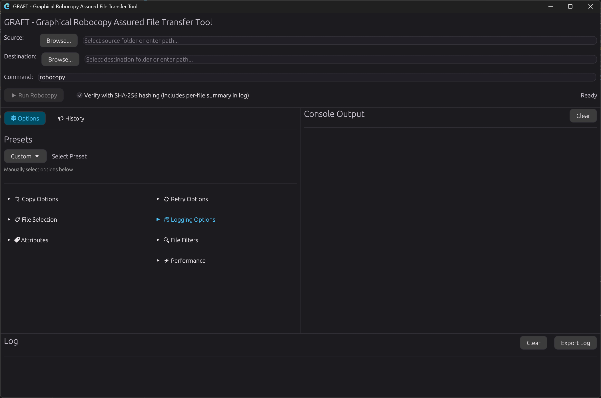

# GRAFT

**Graphical Robocopy Assured File Transfer Tool**

GRAFT is a native Windows PowerShell 5.1/WPF interface for Robocopy. It provides safe, visible file transfers with configurable presets, live output, SHA-256 verification, history, and audit logs. The primary application is [`graft.ps1`](graft.ps1) and requires no third-party modules or runtimes on a stock Windows 11 installation.

> This project was developed with AI assistance.



*The screenshot shows the original Rust interface. The PowerShell GUI keeps the same overall workflow while adding an explicit Folder/File source selector.*

## Features

- Native WPF dark-theme GUI with resizable options, console, and log panels
- Folder or single-file sources, destination browser, recent-path lists, and AFT ticket numbers
- Live command preview and real-time, color-coded Robocopy output
- Presets for Large Files over WAN, Mirror with Full Metadata, Copy All and Preserve Attributes, Incremental Backup, and Quick Copy
- Full custom option groups for copy behavior, file selection, attributes, retries, logging, filters, performance, and dry-run mode
- Source SHA-256 hashing, optional destination hashing, and automatic source/destination comparison
- Clear reporting of matched, mismatched, missing, extra, unreadable, or unhashable files
- Parsed transfer statistics for files, directories, bytes, speed, and Robocopy exit status
- Cancellable copy and hashing operations without freezing the GUI
- Destructive-option confirmation for `/MIR`, `/PURGE`, `/MOV`, and `/MOVE`
- Saved and recent command history with rename, load, rerun, delete, and log-export actions
- Automatic operation logs, manual log export, last-configuration restore, and File/Help menus

## Requirements

- Windows 11
- Windows PowerShell 5.1, included with Windows
- Robocopy and the .NET Framework WPF assemblies, also included with Windows

PowerShell 7 (`pwsh`), Rust, package managers, and external PowerShell modules are not required for the PowerShell GUI.

## Run the PowerShell GUI

Download or clone the repository, then launch GRAFT from its directory:

- Double-click `graft.cmd` for a console-free launch, or
- run the script directly from PowerShell:

```powershell
powershell.exe -NoProfile -STA -File .\graft.ps1
```

The `-STA` option ensures that WPF and the native file dialogs run in the required single-threaded apartment.

### Execution policy

Windows may block a downloaded PowerShell script. If you trust this copy of GRAFT, either unblock the script once:

```powershell
Unblock-File -LiteralPath .\graft.ps1
powershell.exe -NoProfile -STA -File .\graft.ps1
```

Or use a process-scoped policy override for this launch only:

```powershell
powershell.exe -NoProfile -STA -ExecutionPolicy Bypass -File .\graft.ps1
```

The process-scoped command does not change the machine or user execution policy. Do not bypass execution policy for scripts you do not trust.

## Use

1. Choose whether the source is a folder or a single file, then select the source and destination.
2. Optionally enter an AFT ticket number.
3. Select a preset or expand the option groups to create a custom Robocopy command.
4. Enable source hashing and, if needed, destination hash verification.
5. Use Dry Run (`/L`) to preview a sensitive operation.
6. Select **Run Robocopy**, review any safety confirmation, and monitor the console and status display.

The default **Large Files over WAN** preset uses:

```text
/E /COPY:DAT /DCOPY:DAT /J /NP /R:3 /W:5 /MT:8
```

GRAFT also adds `/XJ` so Robocopy and verification both skip junction traversal, plus `/UNICODE` for redirected status output. A private temporary Unicode Robocopy log preserves filenames that cannot be represented by the active Windows console code page; it is streamed into the GUI and removed when the process finishes.

Source hashing can be used independently. When both hash options are selected, GRAFT compares relative paths and SHA-256 values after a successful Robocopy run. Hash read failures are shown with their paths and prevent a successful verification result.

Because `/MOV` and `/MOVE` delete the source before post-copy hashing can run, GRAFT requires Source File Hash to be disabled for live move operations. Destination hashing remains available, and Dry Run (`/L`) is exempt because it does not delete the source.

## Data and logs

GRAFT stores per-user data under:

```text
%LOCALAPPDATA%\Graft
```

- `history.json` contains command history, saved entries, recent paths, and the last configuration.
- `logs\graft_*.log` contains automatically saved operation logs.

Logs include the source, destination, effective command, ticket and user information, transfer statistics, file status information, hashes, verification results, and detailed operation output. Logs can also be exported from the current run or from a history entry.

## Robocopy exit codes

Robocopy uses bit-oriented status codes. GRAFT treats codes below 8 as completed without copy failures and codes 8 or higher as failures.

| Code | Meaning |
| ---: | --- |
| 0 | No files copied; source and destination are in sync |
| 1 | Files copied successfully |
| 2 | Extra files or directories detected in the destination |
| 3 | Files copied and extras detected |
| 4 | Mismatched files or directories detected |
| 5-7 | Copy completed with combinations of copied, extra, or mismatched items |
| 8-15 | One or more files or directories could not be copied |
| 16+ | Serious error; no files were copied |

## Self-test

Run the built-in, dependency-free checks without opening the GUI:

```powershell
powershell.exe -NoProfile -STA -File .\graft.ps1 -SelfTest
```

The self-test creates its own disposable folder under the Windows temporary directory. It validates presets, argument construction, exact Unicode Robocopy output, a real isolated copy, hashing, cancellation, case-insensitive comparison, history round trips, and WPF initialization without touching user transfer paths.

## Legacy Rust application

The original Rust/egui implementation remains in `src` for reference. Building it is optional and is not required to run the PowerShell GUI.

```powershell
cargo build --release
```

The legacy executable is written to `target\release\graft.exe`. Its dependencies and package metadata are defined in `Cargo.toml`, and `build.rs` creates its Windows resources.

## Project structure

```text
graft/
|-- graft.cmd          # Console-free Windows launcher
|-- graft.ps1          # Primary native PowerShell/WPF application
|-- README.md
|-- Cargo.toml         # Legacy Rust package definition
|-- build.rs           # Legacy Rust Windows resources
|-- docs/
|   `-- screenshot.png
`-- src/               # Legacy Rust implementation
    |-- main.rs
    |-- app.rs
    |-- robocopy.rs
    |-- hasher.rs
    `-- history.rs
```

## License

MIT License.

## Acknowledgments

- Robocopy, Windows PowerShell, and WPF are included with Windows.
- The legacy Rust application uses `egui`, `eframe`, and `rfd`.
- Development was assisted by GitHub Copilot, Claude, and ChatGPT.

## Security notes

- Review source and destination paths carefully before using destructive options.
- Prefer Dry Run before mirror, purge, or move operations.
- The optional Rust dependency audit can be run with `cargo audit`.
